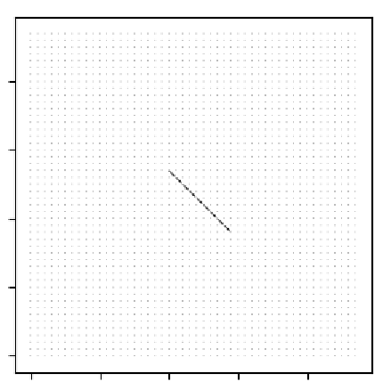
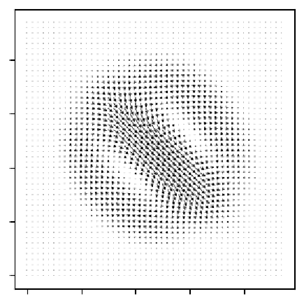

## Steady Flow DNN

Using DNNs to solve Navier Stokes equations for **steady** (dv/dt = 0) fluid flow given some subset of fluid's velocity field.

In practice - feed in some incomplete velocity field to the network
(*The image quality is horrible, those are arrows pointing to the bottom right corner*):

And get velocity field that behaves *roughly* according to fluid dynamics:

**Note: The DNN is trained only on input velocity fields which are line segments with velocity values pointing in direction of line. To generalize to arbitrary input velocity fields, training data generator would need to be changed.**

## Density and Viscosity parameters

Network additionally accepts two inputs - density (in g/cm3) and viscosity (in g/(cm*s)) of the "simulated" liquid:

Density changes across rows, viscosity across columns.

